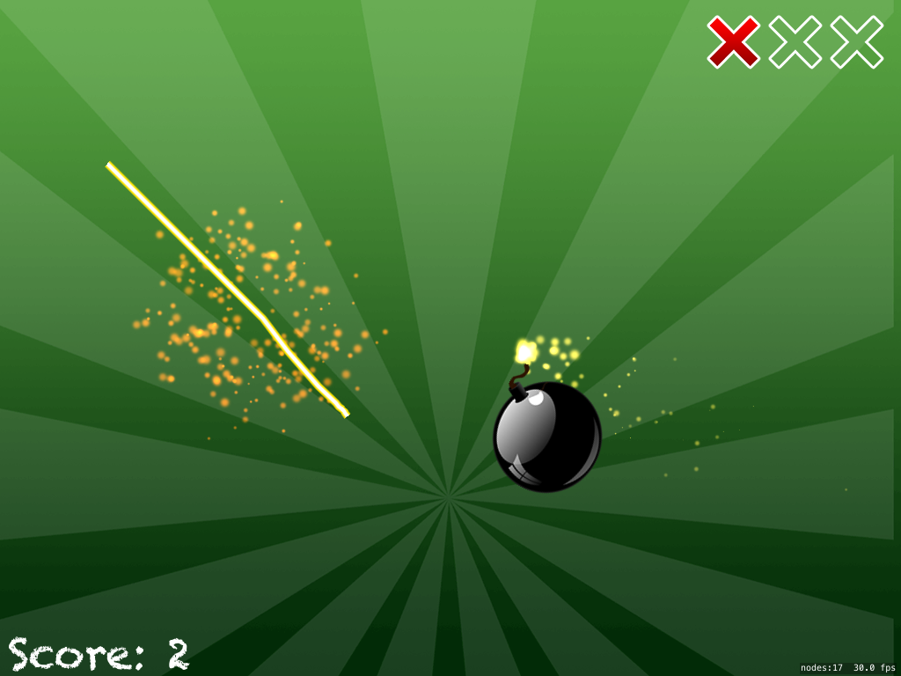

# SwiftyNinja
Repo following Project 17: Swifty Ninja at hackingwithswift.com




## Concepts learned/practiced
* ```SKShapeNode```
* Enums(enumerations) - defines common type for a group of related values
  * Example 1:
    ```Swift
    enum ForceBomb {
      case Never, Always, Default
    }
    ```
  * Example 2 where enum is mapped to integer values:
    ```Swift
    enum SequenceType: Int {
      case OneNoBomb, One, TwoWithOneBomb, Two, Three, Four, Chain, FastChain
    }
    ```

* Defining gravity using CGVector
  * Example from project:
    ```Swift
    physicsWorld.gravity = CGVector(dx: 0, dy: -6)
    physicsWorld.speed = 0.85

    ```
* Using ```AVAudioPlayer```
* ```UIBezierPath```
* Default method parameters
  * Example:
    ```Swift
    func createEnemy(forceBomb forceBomb: ForceBomb = .Default) {
      // some sweet Swift code here...
    }
    ```

## Attributions
[Project 17: Swifty Ninja: SKShapeNode, AVAudioPlayer @ hackingwithswift.com](https://www.hackingwithswift.com/read/17/overview)
